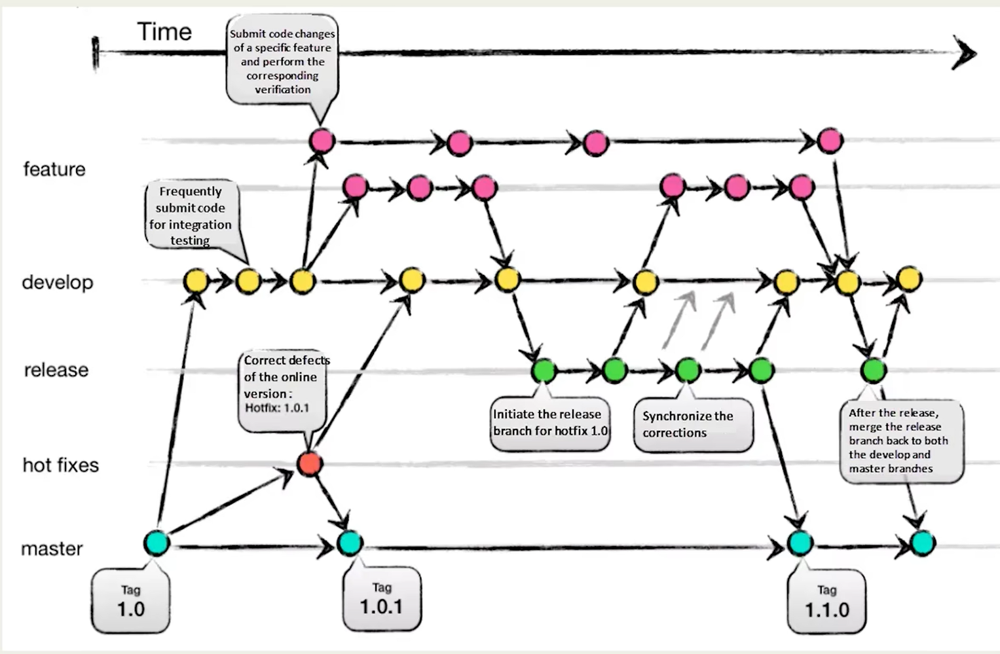

# git的基础命令很简单，我们继续学习分支

> 下面是一个经典的git流模型

- develop是测试分支
- hot fixes是修bug用的
- feature开发新功能

## branch

1. git branch --list ：查看分支
2. git checkout *分支名称*：切换分支

## 融合 merge 

## 储存 stash 

- 在切换分支之前，还有修改文件没有提交，就存储，切换回来继续

## 重置 reset

1. soft
2. hard

## 变基 rebase

- 基本功能跟融合差不多，还可以让提交记录变得好看
- 重要，可以把之前的提交记录修改，删除和融合一起，慎用